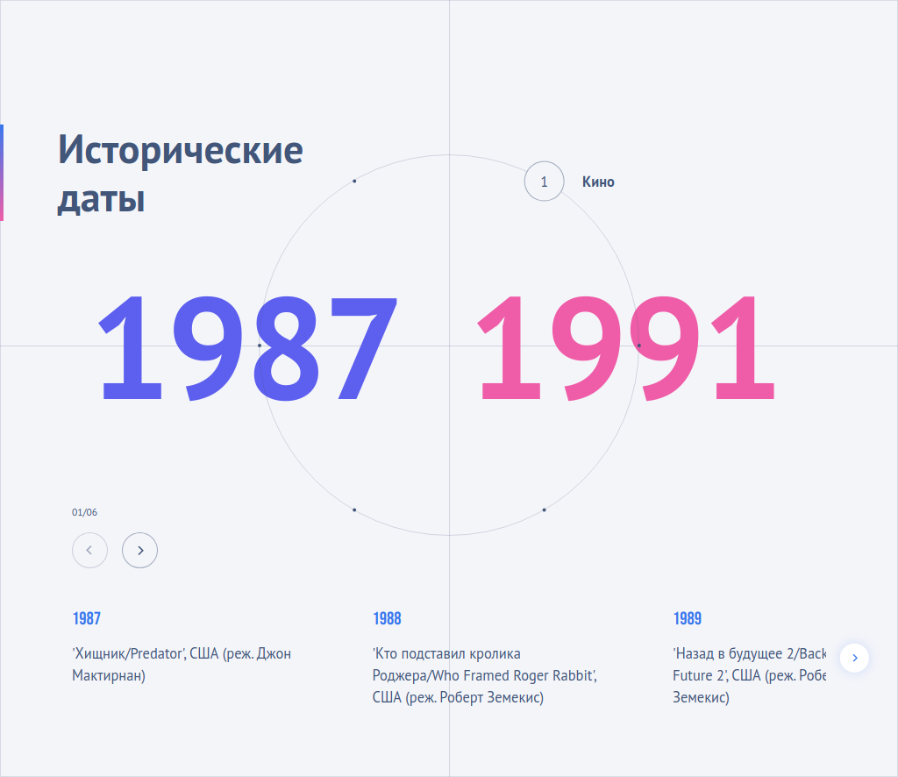

# 🌍 Временная шкала мировых событий

Интерактивное веб-приложение для визуализации исторических событий в различных сферах: кино, искусство, наука, литература, музыка и спорт.



## Демо

[world-events-timeline.vercel.app](https://world-events-timeline.vercel.app/)

## 🚀 Особенности

- **Интерактивное колесо навигации** для переключения между категориями событий
- **Плавные анимации** с использованием кривых Безье
- **Адаптивный дизайн** для desktop и mobile устройств
- **Современный минималистичный интерфейс**
- **Типизация TypeScript**
- **Модульная архитектура**

## 🛠 Технологии

- **React** - для построения пользовательского интерфейса
- **TypeScript** - для типобезопасности
- **SCSS Modules** - для стилизации компонентов
- **Swiper** - для слайдера событий
- **Vite** - для сборки проекта
- **Vitest** - для тестирования

## 📱 Адаптивность

Приложение адаптировано под различные устройства:

- Desktop (1920px и выше)
- Tablet (до 860px)
- Mobile (до 730px)

## ✅ Тестирование

Проект покрыт юнит-тестами с использованием Vitest:

- Тесты для утилит и хелперов
- Тесты для бизнес-логики
- Тесты для форматирования данных

## 🚀 Запуск проекта

1. Клонируйте репозиторий:

```bash
git clone https://github.com/teplostanski/world-events-timeline.git
```

2. Установите зависимости:

```bash
npm install
```

3. Запустите проект:

```bash
npm run dev
```

4. Откройте [http://localhost:5173](http://localhost:5173) в браузере

## 🧪 Запуск тестов

```bash
# Запуск тестов
npm run test

# Проверка покрытия кода тестами
npm run test:coverage
```
